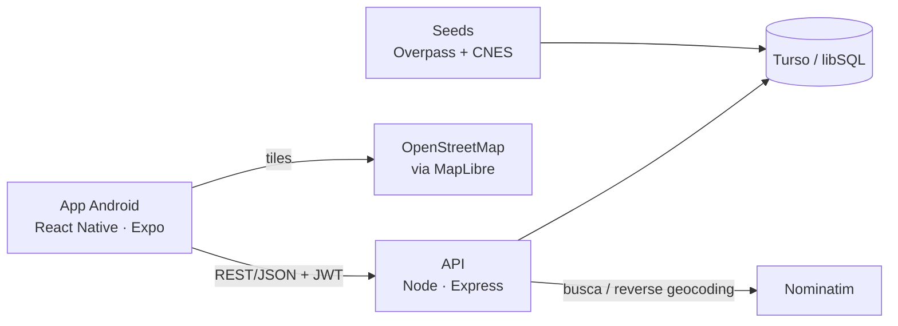

# 📍 Mapa Farma

**CRM comercial mobile para representantes de uma distribuidora de medicamentos em Maceió/AL.**
Os representantes veem as farmácias da cidade num mapa real, registram visitas, lançam pedidos e acompanham a carteira e as vendas, tudo num app Android nativo.

> Projeto feito para um cliente real. Está no ar e em uso pela equipe comercial.
> Nenhum dado do cliente está neste repositório.


---

## O problema

A distribuidora não tinha um app para o trabalho de rua. Os representantes controlavam **visitas, pedidos e rotas em planilhas**. Não havia uma visão única de quais farmácias eram clientes, quem foi visitado e quando, nem de quem paga em dia.

## O que o app faz

| Aba | Funcionalidades |
|---|---|
| **Mapa** | Todas as farmácias de Maceió num mapa real · busca por nome ou bairro · filtros (cliente, status de visita, perfil de pagamento) · legenda cliente / não cliente · "Rota" abre Google Maps ou Waze |
| **Ficha** | Dados da farmácia · marcar como cliente · status de visita · perfil de pagamento e de compra · registrar visita (data automática, horário, duração, observação) · histórico em timeline · registrar pedido direto da ficha |
| **Pedidos** | Totais vendido / recebido / a receber · gráfico de vendas por mês ou semana · troca de status inline · criar, editar e excluir pedido |
| **Painel** | Período de 7/30/90 dias · visitas e farmácias visitadas · melhores clientes · sem visita há mais tempo · perfil de pagamento da carteira · visitas por vendedor |
| **Conta** | Usuário logado · contadores · lista da equipe · sair |

A equipe também pode **cadastrar farmácias** que não estão no mapa (com busca de endereço e escolha do ponto no mapa), além de editar ou excluir as que cadastrou.

---

## Decisões técnicas

**MapLibre + OpenStreetMap em vez de Google Maps.**
O cliente queria uma solução gratuita. O MapLibre com tiles do OpenStreetMap dispensa chave de API e cobrança por uso. O `react-native-maps` foi descartado porque usa o Google Maps SDK como base no Android.

**App nativo em vez de PWA.**
A primeira versão foi planejada como PWA (React + Vite). Ela virou um app React Native (Expo) com `.apk` gerado pelo EAS Build, porque a equipe queria um app instalado de verdade, não um atalho do navegador. O backend não mudou com a troca.

**Base de farmácias montada a partir de dados abertos.**
- **Overpass API (OpenStreetMap):** carga inicial com as farmácias de Maceió.
- **CNES / DataSUS (API de Dados Abertos):** seed complementar, que descarta unidades públicas e institucionais (CEAF, hospitais etc.).
- **Deduplicação:** se a mesma farmácia aparece nas duas fontes a ≤150 m e com nome compatível, os campos vazios são enriquecidos em vez de duplicar o registro.
- **Limite do município:** um teste *point-in-polygon* (ray casting) contra o polígono real de Maceió descarta coordenadas erradas do CNES, como pontos caídos na lagoa ou em Rio Largo.
- **Origem rastreada:** cada farmácia guarda se veio de `seed` ou foi cadastrada como `manual`. Só as manuais podem ser editadas ou excluídas pela equipe.

**Perfil de pagamento "efetivo".**
O perfil de uma farmácia (`paga_em_dia` / `atrasa` / `nao_paga`) segue esta regra: o **ajuste manual vence**; sem ajuste, ele é **derivado do status do pedido mais recente**. Uma única função SQL alimenta a Ficha, o filtro do Mapa e o Painel. Assim o app não mostra respostas diferentes em telas diferentes.

**Datas no fuso de Maceió.**
O app raciocina em dias locais. Se a data do pedido fosse gravada em UTC, uma venda feita às 22h cairia no dia seguinte. Por isso o fallback de data usa o dia local de Maceió (UTC−3), independente do fuso do servidor, e isso é coberto por teste.

**Simplicidade onde dava.**
O banco é único e compartilhado pela equipe. `usuario_id` registra *quem* fez algo, mas nunca restringe a visibilidade, e não existe sistema de papéis. As estatísticas são sempre calculadas por query, sem tabelas pré-agregadas.

---

## Arquitetura



Monorepo com dois apps independentes:

```
Mapa-Farma/
├── client/                 # App nativo (Expo + React Native)
│   ├── src/screens/        # Login, Mapa, Ficha, Registrar, Histórico, Painel, Pedidos, Conta
│   ├── src/components/     # Bottom sheets, marcador, filtros, tab bar…
│   ├── src/api/            # Cliente REST (fetch + token JWT)
│   ├── src/lib/            # Enums, formatação (BRL, datas), gráfico, hit test do mapa
│   └── test/               # node:test
├── server/                 # API (Node + Express + libSQL)
│   ├── src/routes/         # auth, farmacias, pedidos, stats, usuarios, geo
│   ├── src/migrations/     # SQL versionado (001, 002, 003)
│   ├── src/seed/           # Overpass e CNES
│   ├── src/lib/            # Perfil efetivo, limite de Maceió, geocode, datas
│   └── test/               # node:test
└── docs/superpowers/       # Specs e planos de cada feature
```

## Stack

**Mobile:** React Native 0.86 · Expo SDK 57 · React Navigation · MapLibre React Native · Gorhom Bottom Sheet · Reanimated · expo-location · AsyncStorage
**Backend:** Node.js 24 · Express · @libsql/client (Turso) · JWT · bcrypt
**Dados externos:** OpenStreetMap (Overpass) · CNES/DataSUS · Nominatim
**Build:** EAS Build (`.apk` interno · `app-bundle` para produção)

---

## Rodando localmente

### Backend

```bash
cd server
cp .env.example .env        # banco local em arquivo por padrão (file:./mapa_farma.db)
npm install
npm run migrate             # cria as tabelas
npm run seed                # importa as farmácias de Maceió do OpenStreetMap
npm run seed:cnes           # complementa com o CNES (use --dry para só simular)
npm run dev                 # API em http://localhost:3001
```

Para criar um usuário de acesso:

```bash
node --input-type=module -e "
import 'dotenv/config';
import bcrypt from 'bcryptjs';
import { db } from './src/db.js';
await db.execute({
  sql: 'INSERT INTO usuarios (nome, email, senha_hash) VALUES (?, ?, ?)',
  args: ['Seu Nome', 'voce@exemplo.com', bcrypt.hashSync('sua-senha', 10)],
});
console.log('usuário criado');"
```

### App

O MapLibre é um módulo nativo, então o app **não roda no Expo Go**. É preciso um *development build*:

```bash
cd client
npm install
npx expo run:android        # ou: eas build --profile development --platform android
```

Em desenvolvimento, o app descobre sozinho o IP da máquina pelo Metro e chama a API na porta `3001`. O celular precisa estar na mesma rede. Nos builds `preview` e `production`, a URL da API vem de `EXPO_PUBLIC_API_URL` no `eas.json`.

### Testes

```bash
cd server && npm test
cd client && npm test
```

Os testes cobrem rotas de farmácias e pedidos, perfil efetivo, limite do município, geocoding, datas locais, regras de exclusão, formatação, gráfico e o hit test do mapa.

---

## Próximos passos

- [ ] Notificações push: alertas às 8h e resumo diário por vendedor às 22h30. O schema já está pronto (migration `003`), falta o envio.
- [ ] Card no Painel com as farmácias nunca visitadas mais próximas do vendedor.
- [ ] Recuperação de senha.

## Autor

**Samuel Lourenço** · [Portfólio](https://portfolio-murex-zeta-35.vercel.app) · [LinkedIn](https://www.linkedin.com/in/samuel-lourenco-50b780306/) · [GitHub](https://github.com/samuellouren)

Licença [MIT](LICENSE).
